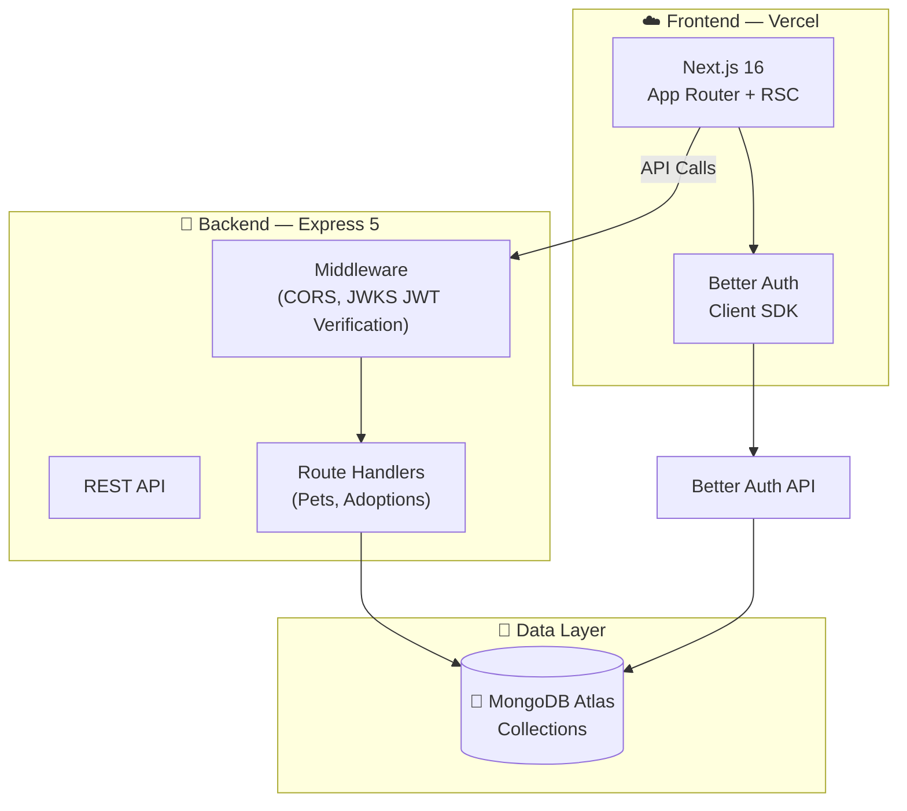

<div align="center">

# 🐾 PetHouse

### Find Your Best Friend. Give Them a Loving Home.

A **full-stack** pet adoption platform connecting loving families with pets in need. Features secure authentication, comprehensive pet search, adoption request management, and a user-friendly dashboard.

&nbsp;

[](https://nextjs.org/)
[](https://react.dev/)
[](https://tailwindcss.com/)
[](https://www.mongodb.com/)
[](https://expressjs.com/)
[](https://www.better-auth.com/)
[](https://heroui.com/)

&nbsp;

🌐 [**Live Website**](https://pethouse-delta.vercel.app/) &nbsp;·&nbsp; 🔌 [**Server Repo**](https://github.com/ashiqurrhmn/PetHouse-Server)

</div>

---

## 📖 Table of Contents

- [Overview](#-overview)
- [Why PetHouse Stands Out](#-why-pethouse-stands-out)
- [Tech Stack](#-tech-stack)
- [Key Features](#-key-features)
- [Architecture](#-architecture)
- [Getting Started](#-getting-started)
- [Environment Variables](#-environment-variables)
- [Deployment](#-deployment)
- [Author](#-author)

---

## 🎯 Overview

**PetHouse** is a fully-featured pet adoption marketplace connecting individuals looking to adopt with those looking to rehome pets. Built with Next.js 16's App Router and React Server Components on the frontend, backed by an Express 5 REST API and MongoDB, it delivers a seamless and heartwarming experience for pet adoption. 

---

## ✨ Why PetHouse Stands Out

| | Feature | Description |
|---|---|---|
| 🔐 | **Better Auth Integration** | Seamless email/password and Google Social authentication with MongoDB adapter and JWT session management. |
| 🐾 | **Pet Discovery** | Comprehensive search with filtering by species, breed, and name to help users find their perfect companion. |
| 📋 | **Adoption Workflow** | End-to-end adoption request system where users can apply for pets and owners can manage incoming requests. |
| 👤 | **User Dashboards** | Dedicated dashboards for users to manage their pet listings and track their adoption requests. |
| 🎨 | **Beautiful UI/UX** | Clean, modern design powered by Tailwind CSS v4, HeroUI, and Framer Motion animations. |
| ⚡ | **React Compiler + RSC** | Next.js 16 with React 19, React Compiler enabled, and Server Components for blazing-fast performance. |

---

## 🔧 Tech Stack

### Frontend

| Technology | Version | Purpose |
|---|---|---|
| **Next.js** | 16.x | App Router, React Server Components, API Routes |
| **React** | 19.x | UI library with concurrent features + React Compiler |
| **Tailwind CSS** | v4 | Utility-first responsive styling |
| **HeroUI** | 3.x | Accessible, beautiful component library |
| **Framer Motion** | 12.x | Page transitions, hover effects, micro-animations |
| **Better Auth** | 1.6+ | Authentication (Email/Password + Google) with MongoDB adapter |
| **Lucide React** | 1.x | Clean and consistent icon set |

### Backend

| Technology | Version | Purpose |
|---|---|---|
| **Node.js + Express** | 5.x | High-performance REST API server |
| **MongoDB** | 7.x | NoSQL database via native driver |
| **Jose** | 6.x | JSON Web Token verification using remote JWKS |
| **CORS + Dotenv** | Latest | Middleware and environment configuration |

---

## 🔑 Key Features

### 🔒 Authentication & Authorization
- Email/password registration and sign-in via **Better Auth**.
- Social Login via Google.
- Secure JWT-based session handling with MongoDB-backed persistence.
- Protected routes for dashboards and adoption processes.

### 🔍 Pet Discovery & Browsing
- Browse all available pets with full-text search capabilities.
- Filter pets by species (Dogs, Cats, Birds, etc.).
- Dedicated featured pets section for high-visibility adoption cases.
- Detailed pet profile pages with vital information and an "Adopt Now" call to action.

### 📊 User Dashboard

- **Add Pet**: A comprehensive form for users to list pets for adoption, including image uploads and details.
- **My Listings**: Manage (Edit/Delete) the pets you have listed for adoption. Track incoming adoption requests for each pet.
- **My Requests**: Keep track of the adoption requests you have sent to others, including their approval/rejection status.

### 💅 UI/UX & Design
- Clean and welcoming interface designed to highlight pet photos.
- Smooth Framer Motion animations for pet cards and page transitions.
- Responsive design tailored for optimal viewing on mobile, tablet, and desktop.
- Interactive components like Modals, Dropdowns, and Alerts from HeroUI.

---

## 🏗️ Architecture



### Database Collections

| Collection | Purpose |
|---|---|
| `user`, `session`, `account` | User authentication records and sessions (managed by Better Auth) |
| `animals` | Pet listings containing name, species, breed, description, and owner details |
| `adoptions` | Adoption requests linking prospective adopters to specific pets and their owners |

---

## 🚀 Getting Started

### Prerequisites

- **Node.js** v18+ (v22 recommended)
- **MongoDB** cluster ([MongoDB Atlas](https://www.mongodb.com/atlas) recommended)

### Installation

```bash
# ── 1. Clone the repository ──────────────────────────────

git clone https://github.com/ashiqurrhmn/PetHouse-Server.git
# Note: Clone the client repository similarly.

# ── 2. Set up the Backend ───────────────────────────────────

cd PetHouse-Server
npm install

# Create .env file (see Environment Variables section below)

# Start the server
npm run dev # or node index.js
# → Server runs on http://localhost:5000

# ── 3. Set up the Frontend ──────────────────────────────────

cd ../pethouse
npm install

# Create .env file (see Environment Variables section below)

# Start development server
npm run dev
# → Frontend runs on http://localhost:3000
```

---

## 🔐 Environment Variables

### Frontend (`pethouse/.env`)

```env
# MongoDB connection (used by Better Auth)
MONGO_URI=mongodb+srv://<user>:<password>@<cluster>.mongodb.net
AUTH_DB_NAME=pethouse

# Better Auth
BETTER_AUTH_SECRET=your-secret-key
BETTER_AUTH_URL=http://localhost:3000

# Google OAuth
GOOGLE_CLIENT_ID=your-google-client-id
GOOGLE_CLIENT_SECRET=your-google-client-secret

# Backend API URL
NEXT_PUBLIC_BASE_URL=http://localhost:5000
```

### Backend (`pethouse-server/.env`)

```env
# MongoDB
MONGO_URI=mongodb+srv://<user>:<password>@<cluster>.mongodb.net

# CORS and JWKS Verification
CLIENT_URL=http://localhost:3000

# Server
PORT=5000
```

---

## 🌐 Deployment

| Service | Purpose | Details |
|---|---|---|
| **Vercel** | Next.js Frontend | Auto-deploy from GitHub, edge-optimized |
| **Vercel / Render** | Express API Server | Node.js environment hosting |
| **MongoDB Atlas** | Database | Cloud-hosted NoSQL with free tier |

---

## 🗺️ API Endpoints Reference

| Method | Endpoint | Description |
|---|---|---|
| `GET` | `/pets` | List all pets (filterable by search, species, owner) |
| `GET` | `/pets/:petId` | Get single pet details (Protected) |
| `GET` | `/featured` | Get top 6 featured pets |
| `POST` | `/pets` | Add a new pet listing (Protected) |
| `PUT` | `/pets/:petId` | Update a pet listing (Protected) |
| `DELETE` | `/pets/:petId` | Delete a pet listing and related adoptions (Protected) |
| `GET` | `/adoptions/pet/:petId` | Get adoption requests for a specific pet (Protected) |
| `GET` | `/adoptions/:userId` | Get adoption requests made by a user (Protected) |
| `POST` | `/adoptions` | Submit a new adoption request |
| `PATCH` | `/adoptions/:adoptionId` | Update adoption status (Protected) |
| `DELETE` | `/adoptions/:adoptionId` | Delete an adoption request (Protected) |

---

## 👤 Author

<div align="center">

**Built with 🔥 by [Md. Ashiqur Rahman](https://ashiqur-portfolio0.vercel.app/)**

&nbsp;

[](https://ashiqur-portfolio0.vercel.app/)
[](https://github.com/ashiqurrhmn)
[](https://www.linkedin.com/in/ashiqur-rahman00/)
[](mailto:ashiqur1312@gmail.com)

</div>

---

<div align="center">

### ⭐ If you found this helpful, give it a star!

**Built with ❤️ using Next.js 16, Express 5, MongoDB, and Better Auth**

&nbsp;

[](https://github.com/ashiqurrhmn/PetHouse-Server)

&nbsp;

<sub>© 2026 PetHouse. All rights reserved.</sub>

</div>
